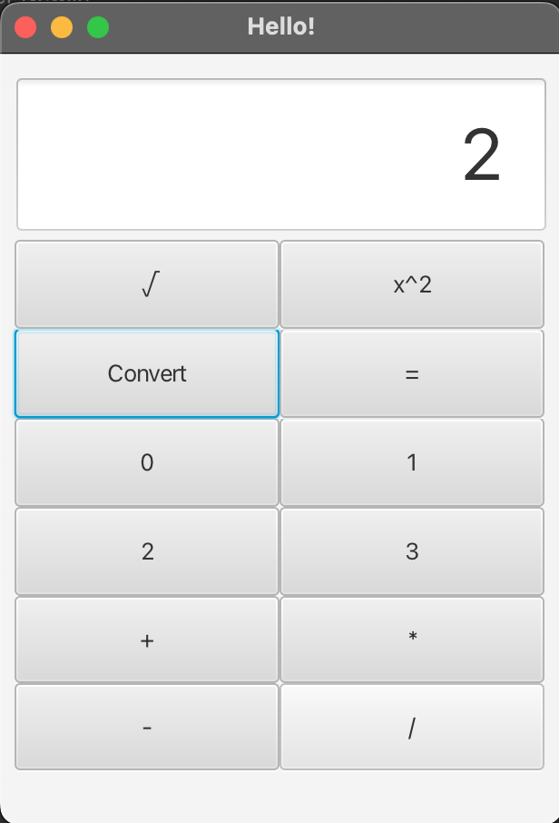
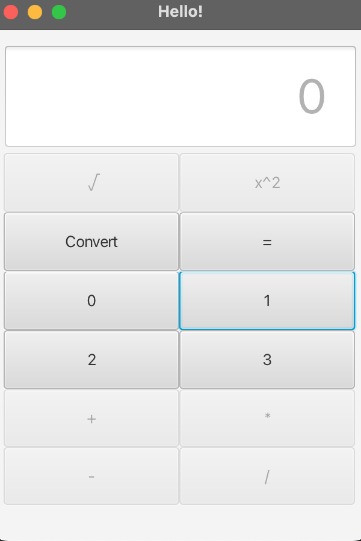
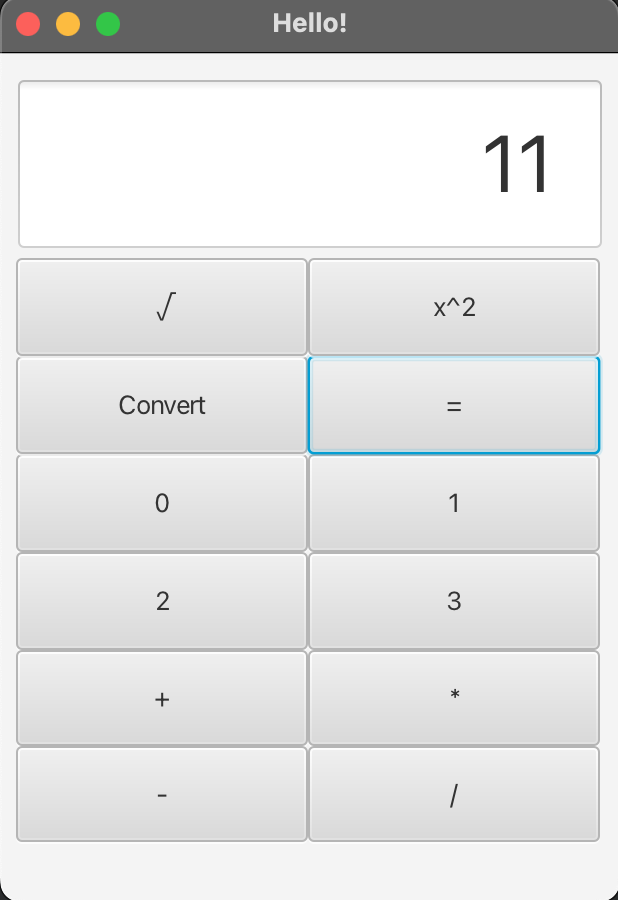
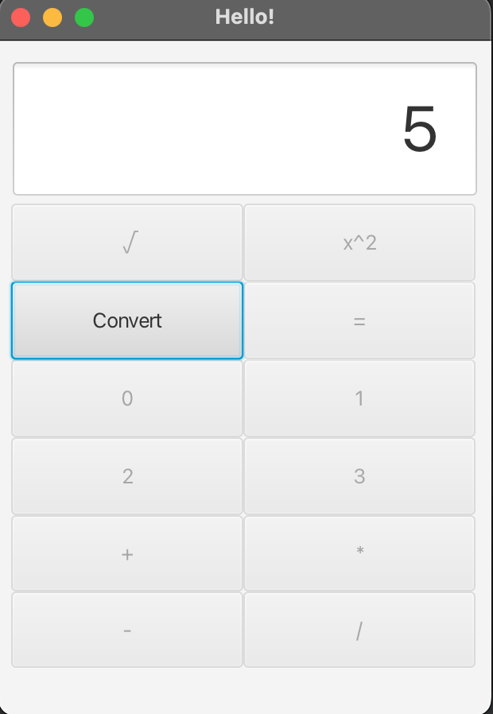

# quaternary-calculator
By Tyler Newlin, Karim Mahfouz, Noah Perez, and Desirée Nelson

## Operation Manual
To use the calculator, you first must press a numbered button. It will look like this.

Once you have selected the first number, you may select which operation you would like to do. Once the operation has been selected, you can select the next number.

You will not be able to chain operations. To see the result, press the "=" key. 

The convert button will show the number in decimal. once it has been pressed you can not do operations. 

## **Meetings**

9/8
The team (Desirée, Tyler, Noah, and Karim) all met in person. We discussed who would do what and then all worked on our portions of the assignment.

9/9
Tyler, Noah, and Karim met in person to discuss diving final tasks and creating tests.

## **Task Distribution**

Desirée- Create UI.

Tyler- Create decimal to quaternary and quaternary to decimal method as well as adding functionality to the UI.

Noah- Create squared functions as well as their tests.

Karim- Make operations class and the tests. 

